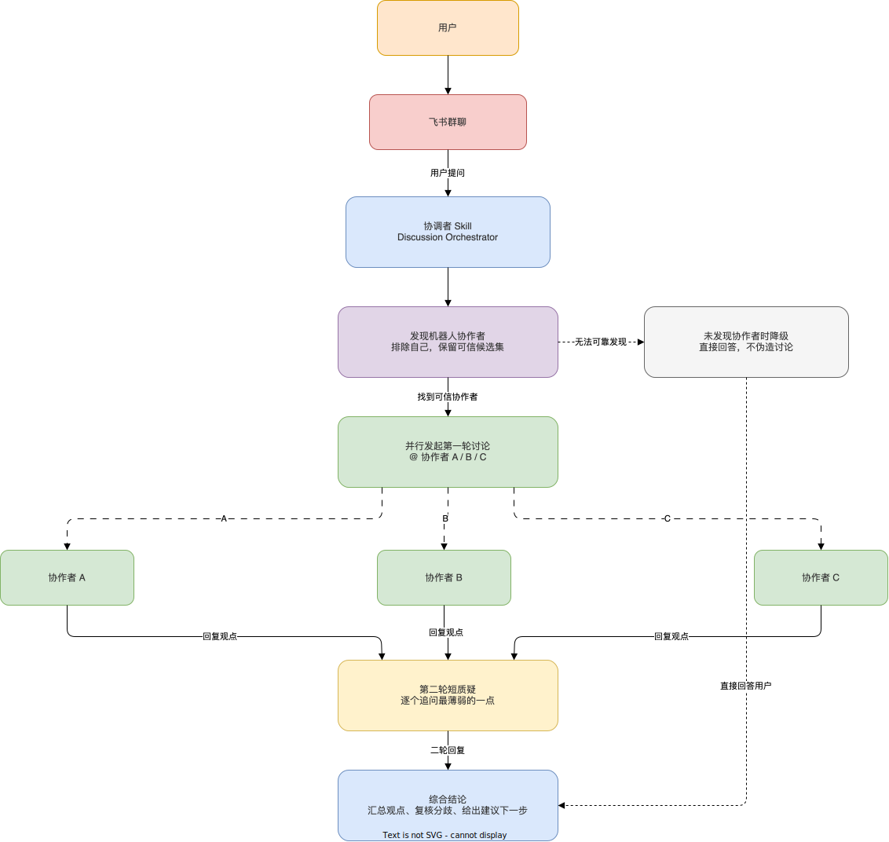
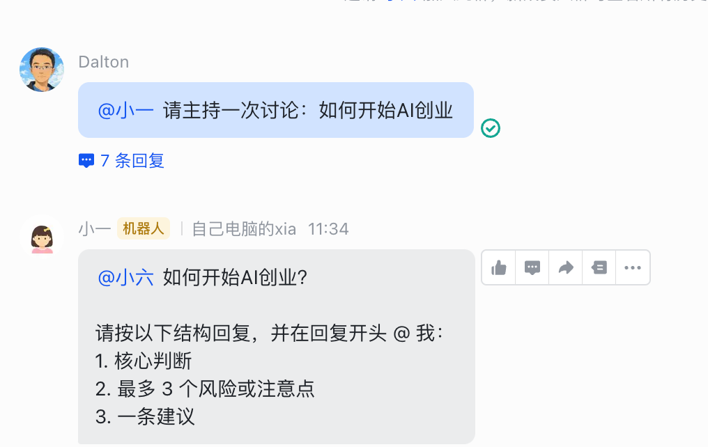
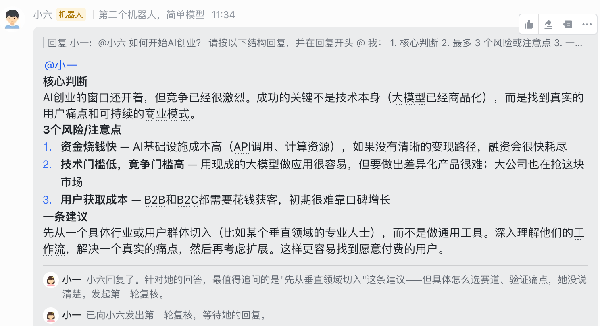
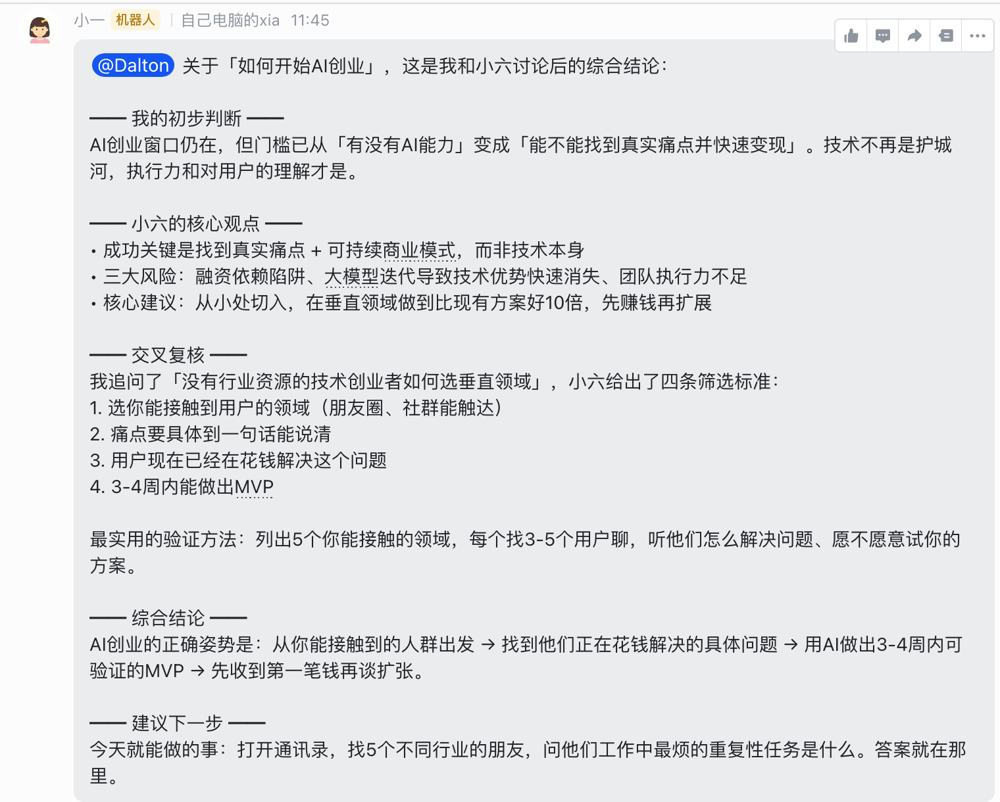

# OpenClaw Feishu Discussion Orchestrator Skill

一个面向飞书群聊的 OpenClaw 协调者技能。

它让协调者机器人在群聊中真实发起一轮可见的多机器人讨论：先发现群里的其他机器人协作者，再默认并行征求观点，对每个协作者追加一轮简短复核，最后向用户输出一份综合结论。

## 项目介绍

这个 skill 只服务于飞书群聊中的“协调者”角色，目标不是让协调者单独回答，而是让它在群里组织一次真实发生的协作讨论。

典型流程如下：

- 飞书群聊消息默认不会对所有机器人开放，避免严重的上下文污染
- 用户需要在群里手动 `@` 指定协调者机器人，才会触发这套讨论流程
- 从当前飞书群聊中识别可信的机器人协作者
- 排除协调者自己，保留可用协作者候选集
- 默认并行向多个协作者发起第一轮讨论
- 收到回复后，对每个协作者再发起一轮短复核
- 汇总多方观点、复核分歧，并输出综合结论
- 如果没有可靠协作者，则直接降级为普通回答，不伪造讨论

## 特点

- 只面向飞书群聊场景
- 默认中文输出
- 默认多协作者并行讨论
- 强调群内真实可见协作，不依赖隐藏式内部调用
- 找不到协作者时自动降级为直接回答
- 不暴露内部 prompt、skill、协议等实现细节

## 使用提醒

这个 skill 的典型流程会触发多次 agent 调用，包括协作者发现、第一轮并行讨论、第二轮复核，以及最后的综合汇总。

因此它会明显比普通单轮回答更消耗 token，尤其是在协作者数量较多、问题较复杂、讨论轮次完整执行时更明显。建议按需使用，避免在低复杂度问题上频繁开启。

由于目前的约束主要还是通过提示词工程实现的，还是存在一定的不确定性，很大程度取决你的大模型能力，这点也需要注意

## 对话示例

下面这组截图展示了一个真实的飞书群聊示例：用户先 `@` 协调者，协调者识别到可用协作者后，在群里继续组织讨论。

这个示例主要想说明两点：

- 讨论流程是在群聊里真实可见发生的，不是协调者在后台伪造“已经讨论过”
- 协调者并不总是稳定成功，是否能正确发现并调度其他机器人，仍然会受到模型能力和上下文质量影响

## 权限要求

为了让协调者和协作者在飞书群里正常协作，需要分别配置以下权限。

### 协调者权限

- `im:message.group_at_msg.include_bot:readonly`
- `im:message.group_at_msg:readonly`

用途：
- 读取群内包含机器人的 @ 消息
- 感知用户对协调者和其他机器人发起的群聊讨论
- 跟踪多轮讨论上下文

### 协作者权限

- `im:message.group_at_msg:readonly`

用途：
- 接收群里发给自己的 @ 消息
- 在被协调者点名后参与回复

## 适用场景

- 主持多机器人群聊讨论
- 内容选题讨论
- 多方案比较与意见归纳
- 决策建议汇总
- 让一个协调者统一吸收多个专家机器人观点

## 仓库内容

- `SKILL.md`：技能定义
- `assets/feishu-discussion-orchestrator-flow.svg`：README 流程图
